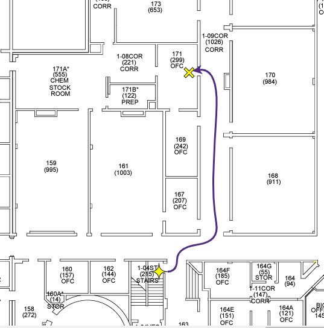
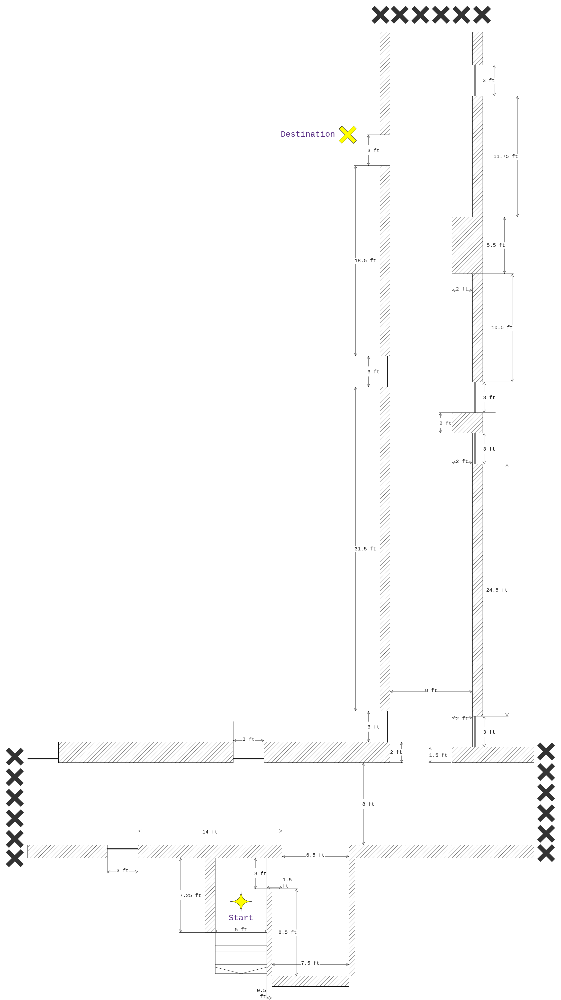

# Final Project: ROS Navigation

## 1. Intro
Welcome to your second (final) project. The goal of this project is to autonomously navigate your robot (from an entrance of Lewis Science Center to the Physics Department office). Your starting point and destination is illustrated in the diagrams below. 




## 2. Instructions
### 2.1 Example Usage
You can use the `diffbot_navigation` package in this repository as a starting point (Clone this repository down to your computer using VS Code) to continue developing. **[`diffbot.urdf.xacro`](diffbot_navigation/urdf/diffbot.urdf.xacro) is the essential of this project**.

1. Build Package
```bash
cd <your ros workspace>
colcon build
source install/local_setup.bash
```
2. Visualize Robot Model 
```bash
# Make sure your package has been built
ros2 launch diffbot_navigation visualize.launch.py
```
3. Gazebo Simulation 
```bash
# Make sure your package has been built
ros2 launch diffbot_navigation simulate.launch.py
```
4. Create a Map and Navigate
```bash
# Make sure your package has been built
ros2 launch diffbot_navigation create_map_nav.launch.py
```
5. Localize in a Map and Navigate
```bash
# Make sure your package has been built
ros2 launch diffbot_navigation localize_nav.launch.py
```

### 2.2 Trouble Shooting


## 3. Requirements
1. Simulated Navigation.
2. Real World Navigation.
3. Thinking, Analysis, Evaluation, Discussion.
4. Documentation. 

### 3.1 Coding
> [Nav2](https://navigation.ros.org/index.html) is an open-sourced project that helps ROS-powered robots to achieve such a goal. It also provides valuable tutorials and guides to help you set up your robot. 
- **(20%)** Simulated Navigation:
    - Build a URDF described robot mobel.
    - Create an SDF file to model the designated navigation environment.
    - Simulate the world model (sdf) and the robot model (urdf) in Gazebo.
    - Make sure the simulation gets the topics: `/cmd_vel`, `/scan`, `/odom` ready in ROS. 
    - Create a map using the [slam_toolbox](https://github.com/SteveMacenski/slam_toolbox) package and **optionally** the [nav2_bringup](https://github.com/ros-planning/navigation2/tree/main/nav2_bringup) package.
    - Navigate your robot from the initial pose to the destined pose with the map created from last step using the [slam_toolbox](https://github.com/SteveMacenski/slam_toolbox) package and the [nav2_bringup](https://github.com/ros-planning/navigation2/tree/main/nav2_bringup) package.
- **(40%)** Real World Navigation
    - Update the ROS node you have developed in Project 1. Now publish the `/odom` topic with [nav_msgs/msg/Odometry](https://docs.ros2.org/foxy/api/nav_msgs/msg/Odometry.html) message.
    - Update the differential controller script on the Pico board that you have developed in Project 1. Now control the robot velocity acoording to the `cmd_vel` topic using PID control.
    - Use [sllidar_ros2](https://github.com/Slamtec/sllidar_ros2) package to publish lidar scanning data under the `/scan` topic.
    
### 3.2 Documentation
- Use this `README` file or create a separate markdown file or upload a pdf file for the documentation.
- Describe the project in concise words. 
- Have the documents well organized (break it down into sections). 
- Please include following contents in your documents.
    1. **(10%)** Update the old supportive documents with new configurations (wiring diagram, mechanical schematics, software workflow, etc.). If not changed, provide a link or a copy of the old files.
    2. **(18%)** Describe the approaches your team employed to map the world, to localize the robot, to plan the trajectories and to follow the trajectories(the more technical details the better).
    3. **(10%)** Read the [NSPE Code of Ethics for Engineers](https://www.nspe.org/resources/ethics/code-ethics), discuss pros and cons of this project with respect to the [Code](https://www.nspe.org/resources/ethics/code-ethics). **You may want to submit such a discussion individually.** 
    5. **(2%)** Summarize achievements you've made in this project (bulleted items are welcome). You can share any thoughs or interesting findings, or discuss the future of the applications here as well.

