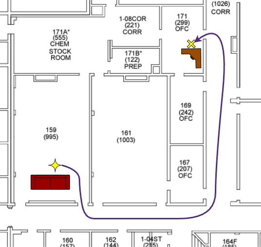

# Final Project: The Odyssey
> [!IMPORTANT]
> # Due: Friday, May 1st @ 12 PM

## Overview
In this project, your robot is expected to **autonomously** navigate in Lewis Science Center from room 159 (Dr. Chen's lab) to room 171 (PAE Department office). 
The starting point and destination is illustrated in the diagram below.
To test the navigation is successful or not, your robot needs to deliver a cup of coffee to the front desk in the office (Rm. 171). 

- The floor plan for the interested area in Lewis Science Center is shown below.

- Coffee will be held in a **12 oz** cup, see dimensions below.

In this project, you will practice.
- Task oriented designs.
- Nitty-gritty of the autonomous navigation.
  - The usage and configuration of `slam_toolbox` and Nav2. 
  - Distributed operations with multiple nodes on multiple devices.

## Get Started Resources
Feel free to use the HomeR software suite as the infrustructure of the project.
- Motion control on the microcontroller: [`homer_pico`](https://github.com/linzhangUCA/homer_pico)
- Motion control interface on the Raspberry Pi: [`homer_bringup`](https://github.com/linzhangUCA/homer_bringup)
- SLAM and navigation on the server computer: [`homer_navigation`](https://github.com/linzhangUCA/homer_navigation)
- For more detailed guides, please refer to the HomeR's [documentation](https://linzhanguca.github.io/homer_docs/).

> [!TIP]
> You will work with a highly integrated system, any tiny changes could fail the entire system.
> - Don't wait until the last minute.
> - Practice ahead as many times as possible.
> - Check your wire connections and battery health **regularly**. 
> - Do simple **unit tests** if something is not functional. 
> - **Take notes** for things you cannot memorize.
> - And **don't be discouraged** to start everything over.

## Requirements

### 1. (20%) Coffee Delivery Solutions
- Introduce mechanical designs of your team's coffee delivery solution.
  - Illustrate layout of key components. 
  - Upload sketches or techdraws with critical dimensions, and display them in [README](README.md).
- Provide an installation guide in [README](README.md).

> [!NOTE]
> **Bonus**:
> - Illustrate installation with graphical ways.

### 2. (15%) Software Usage Instructions
Assume a user is going to deploy the ROS 2 packages related to this project on a Raspberry Pi and a server computer (both with newly installed ROS 2 Jazzy, so, no HomeR packages, no `slam_toolbox`, no Nav2).
Please provide instructions for the following steps:
- (3%) Installing and setting up dependent ROS 2 packages on the Raspberry Pi.
- (3%) Installing and setting up dependent ROS 2 packages on the server computer.
- (3%) Starting the map creation.
- (3%) Saving the map.
- (3%) Starting the autonomous navigation with the saved map.

> [!NOTE]
> **Bonus**:
> - Use CLI for map saving.

### 3. (65%) Navigation Node
- Map the intrested region using proper ROS 2 packages and configurations.
   - Upload map files to the project repository.
   - Log commands for mapping in [README](README.md). 
- Develop a ROS node (in a Python script)for navigating the robot to its destination.from the robot to the center of the "Home Base"
- Config navigator with proper settings.
- Pack your ROS node(s) and configurations.
  Upload the package to the project repository.
  Indicate maintainer's name, email, package description, license information in proper files.
  Your package will be built on instructor's computer. 
- (Optional) Upload any software that is different from the HomeR collections. 

> [!NOTE]
> **Bonus**:
> - Use action in the navigation node.

### 4. (Bonus) 3-Minute Presentation
Please cover the following contents in your presentation and make sure the audience gets plenty eye contacts.
1. Who you are and what are you going to present.
2. Project objectives and results.
3. Navigation approaches.
4. Coffee delivery solutions.
5. Technical Q&As (**No questions, no bonus**).

   
### 5. (Bonus/Penalty) Demonstration
> [!IMPORTANT]
> #### Time: 11 AM - 1 PM on Thursday, Apr. 30th @ LSC159

#### Rules
> - Each team has **3 attempts**.
> - Each attempt will be limited to 5 minutes.
> - Teams with fewer attemps have higher priority in the queue.
> - Bonus/Penalty will be given based on the best attempt.

### Procedure
1. Place the robot on/behind the "Start Line".
2. Start all ROS nodes.
3. Stop the robot and end the navigation with a visible indication.
4. If robot didn't enter the department office, euclidean distance from the navigation cut-off location to the ce will be measured to determine your team's bonus and penalty.
5. (Optional) Take interview, one question for each teammember.

> [!NOTE]
> **Bonus/Penalty Points**:
> - +2 if the robot made it out of LSC159.
> - +3 if the robor made it passing LSC167 (Dr. Mason's office). 
> - +20 if the robot made it to the front desk of the department office.
> - +10 if the robot dodged a dynamic obstabcle.
> - +2 if the robot indicated the end of the navigation on the board.
> - -5 if coffee spilled
> - $$-5d$$ if the robot didn't get into the department office. $d$ is the euclidean distance from the robot's ending location to the closest point of the department door in meters.
>   The maximum distance penalty will be 50 points. 

Be expected to demonstrate the robot not only to the people from Annex 105, but also to anyone who may show up in the hallway of Lewis Science Center.
